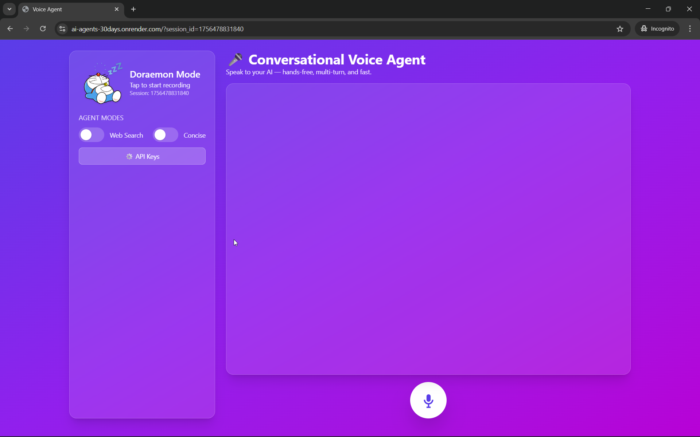
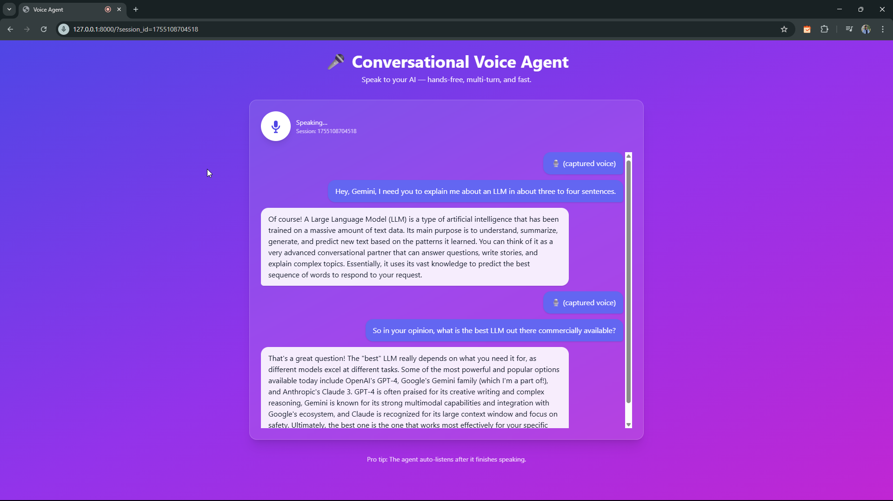
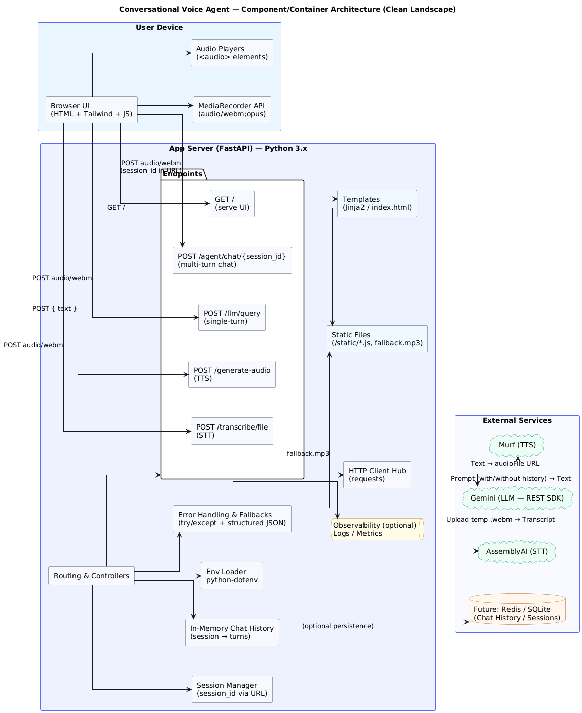
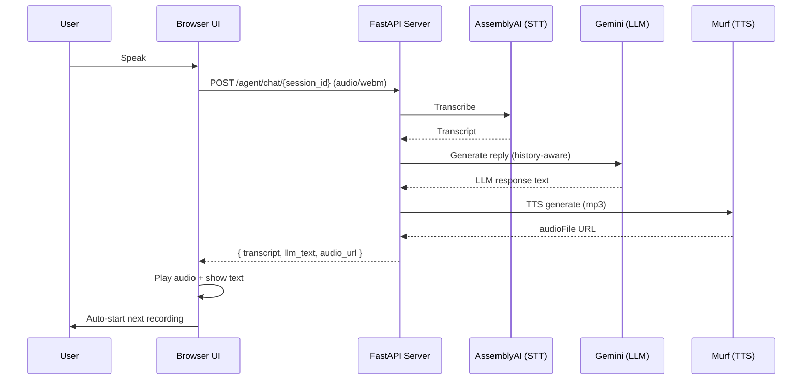

# 🎤 Conversational Voice Agent

> 🗣️ Talk to your AI — get human-like responses back in real time.  
> Powered by **AssemblyAI** (STT) + **Gemini (REST)** (LLM) + **Murf** (TTS).  
> Built as part of **#30DaysofVoiceAgents** by Murf AI.

<p align="center">
  
  
</p>

---

## ✨ What’s inside

- 🎙️ **Hands-free voice chat** — record in browser, hear responses automatically
- 🧠 **Multi-turn memory** — session-based chat history with `session_id`
- 🛡️ **Resilient by design** — graceful fallbacks for STT/LLM/TTS failures
- ⚡ **FastAPI backend** — simple endpoints for TTS, STT, LLM, and agent chat
- 🎨 **Tailwind UI** — clean, responsive, and mobile-friendly
- 🔁 **Auto-continue** — re-starts recording after AI audio finishes

---

## 🧩 Architecture (high level)

<p align="center">
  
</p>

```text
User Voice 🎤
      |
      v
[Browser UI]  --(audio/webm)-->  [FastAPI Server]
                                       |
                                       +--> AssemblyAI (STT)  -- transcript -->
                                       |
                                 chat history (session_id)
                                       |
                                       +--> Gemini (REST)  -- LLM text ------+
                                                                            |
                                                                            v
                                       Murf (TTS)  -- mp3 URL ---> [Browser 🔊]
````

### Mermaid (sequence view)



### 🗂 Project Structure

```bash
.
├─ main.py                # FastAPI app (STT/LLM/TTS endpoints + agent chat)
├─ templates/
│  └─ index.html           # Frontend (Tailwind)
├─ static/
│  ├─ script.js            # Frontend logic (recording, fetch, playback)
│  ├─ fallback.mp3         # Fallback audio when APIs fail
│  └─ screenshots/
│     ├─ ui.png             # UI screenshot (add your own)
│     └─ architecture.png   # Architecture diagram (optional)
├─ .env                   # API keys (NOT committed)
├─ requirements.txt
└─ README.md
```

### 🔑 Environment Variables

Create a `.env` in project root:

```env
MURF_API_KEY=your_murf_api_key_here
ASSEMBLYAI_API_KEY=your_assemblyai_api_key_here
GEMINI_API_KEY=your_gemini_api_key_here
```

**Tip**: Never commit your `.env`. Use `.gitignore`.

-----

## ⚙️ Setup & Run

1.  **Clone & venv**

    ```bash
    git clone [https://github.com/SRB1025X/AI_Agents_30days](https://github.com/SRB1025X/AI_Agents_30days)
    cd AI_Agents_30days

    python -m venv venv
    # macOS/Linux
    source venv/bin/activate
    # Windows
    venv\Scripts\activate
    ```

2.  **Install deps**

    ```bash
    pip install -r requirements.txt
    ```

3.  **Start the server**

    ```bash
    uvicorn main:app --reload
    ```

    Open: `http://127.0.0.1:8000`

-----

## 🔌 API Endpoints (Quick Reference)

**`POST /generate-audio`**

  - **Body**: `{"text": "Hello world"}`
  - **Resp**: `{"ok": true, "audio_url": "https://..."}` (falls back to `/static/fallback.mp3` if needed)

**`POST /transcribe/file`**

  - **FormData**: `file` (audio/webm)
  - **Resp**: `{"ok": true, "transcript": "..."}`

**`POST /llm/query`** (optional, single-turn)

  - **FormData**: `file` (audio/webm)
  - **Resp**: `{"ok": true, "llm_text": "...", "audio_url": "https://...", "transcript": "..."}`

**`POST /agent/chat/{session_id}`**

  - **FormData**: `file` (audio/webm)
  - **Resp**: `{"ok": true, "transcript": "...", "llm_text": "...", "audio_url": "https://..."}`
  - Stores conversation in memory (per `session_id`), sends full history to Gemini (REST), synthesizes Murf mp3.

-----

## 🧪 CURL Smoke Tests

Replace `YOUR_SESSION_ID` first.

```bash
# Health check (HTML)
curl -s [http://127.0.0.1:8000](http://127.0.0.1:8000) | head -n 5

# TTS test
curl -s -X POST [http://127.0.0.1:8000/generate-audio](http://127.0.0.1:8000/generate-audio) \
  -H 'Content-Type: application/json' \
  -d '{"text":"Hello from the voice agent!"}'
```

-----

## 🧱 Error Handling & Fallbacks

Every external call (STT / LLM / TTS) is wrapped in `try/except`.

If something fails, the server returns a structured error with `stage` + `error`.

The client displays a message and auto-plays `static/fallback.mp3` so the experience never “goes silent”.

You can simulate outages by temporarily removing an API key from `.env` and restarting.

**Example server error JSON**

```json
{
  "ok": false,
  "stage": "llm",
  "error": "RuntimeError: Gemini HTTP 403: ...details..."
}
```

-----

## 🧭 Browser Notes (Audio)

  - The app records using `MediaRecorder`: `audio/webm;codecs=opus`.
  - Most Chromium browsers support this. Safari users may need to enable microphone permissions and test codec support.
  - Autoplay policies vary — the app attempts to play after user gesture (record/stop).

-----

## 🧰 Requirements (suggested)

```text
fastapi
uvicorn
python-dotenv
requests
assemblyai
jinja2
```

(Your `requirements.txt` may include more, depending on your setup.)

-----

## 🧭 Roadmap

  - [ ] Replace in-memory history with a durable store (SQLite/Redis/Firestore)
  - [ ] Multi-voice & style controls for Murf
  - [ ] Streamed STT + streamed TTS
  - [ ] Live waveform + VU meter
  - [ ] Simple admin dashboard for session logs


-----

## 🙏 Credits

  - **Murf AI** — Text-to-Speech
  - **AssemblyAI** — Speech-to-Text
  - **Gemini (REST)** — LLM Responses
  - **FastAPI** — Web Framework

-----

## 📜 License

MIT — see `LICENSE`.
