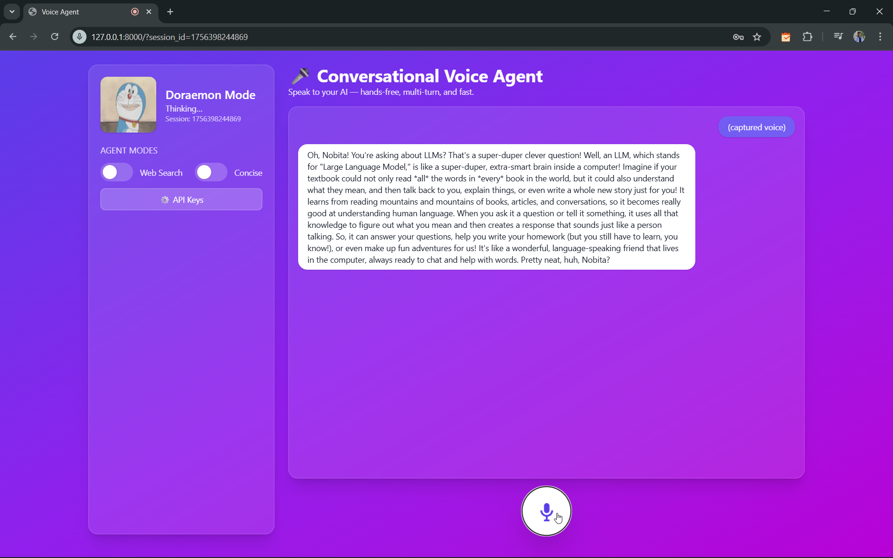
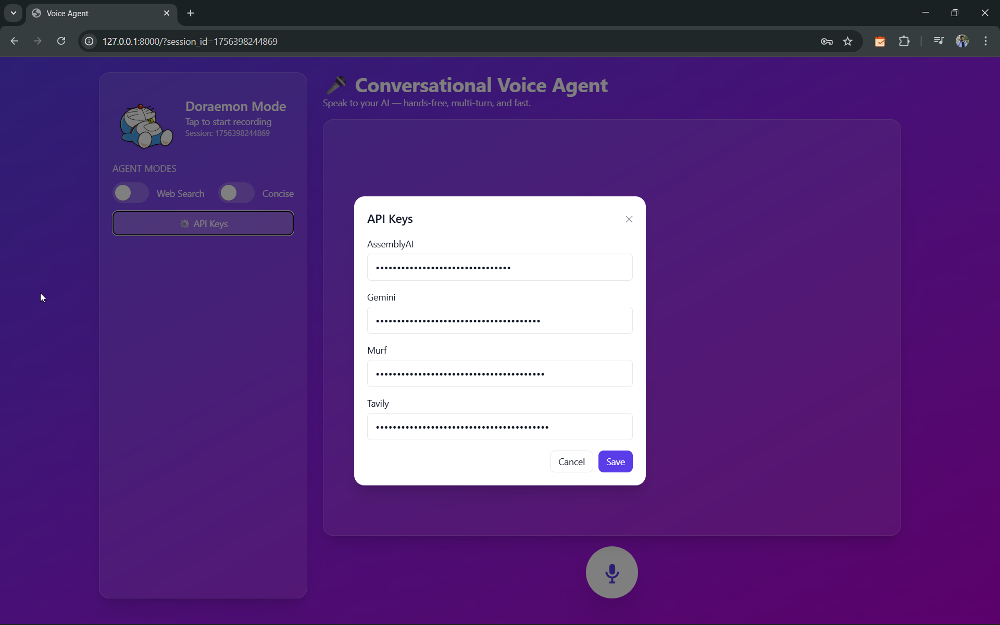
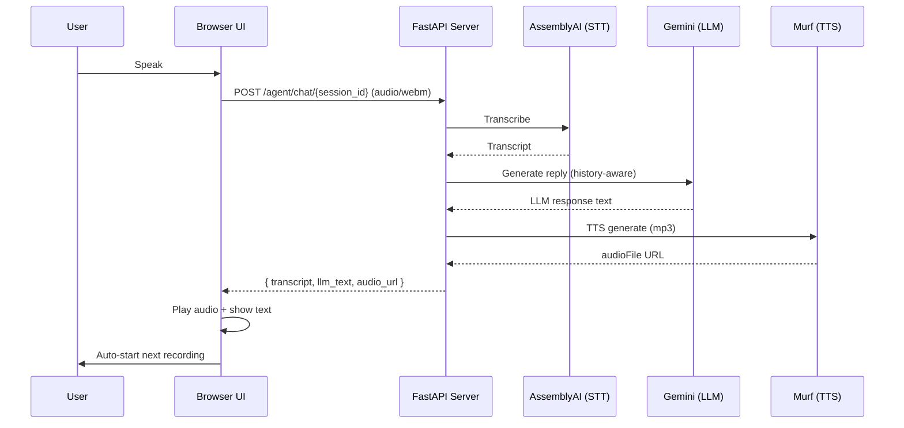

# DoraBot
**Your real-time Doraemon-inspired AI companion that listens, thinks, and speaks back with personality.**

DoraBot is a complete **voice agent pipeline** that combines speech recognition, LLM reasoning, persona-based responses, and real-time speech synthesis — all streamed seamlessly to the client UI.

---

## ✨ Features

- 🎤 **Speech-to-Text (ASR)**: Uses [AssemblyAI](https://www.assemblyai.com/) to transcribe microphone input with turn detection.  
- 🧠 **Conversational Intelligence (LLM)**: Streams responses from [Google Gemini](https://ai.google.dev/) token by token for low-latency replies.  
- 🎭 **Persona Layer**: Responses adopt a Doraemon-inspired persona — cheerful, gadget-loving, and fun.  
- 🌍 **Special Skills**:
  - **Web Search (Tavily API)** – fetches real-time information when the search toggle is ON.  
  - **Concise Mode** – toggle for short answers (≤ 3 sentences).  
- 🔊 **Text-to-Speech (TTS)**: Streams base64 audio chunks from [Murf](https://murf.ai/) over WebSockets and plays them seamlessly in the browser using `AudioContext`.  
- 💬 **Chat History**: Maintains conversational context across turns.  
- ⚡ **Streaming Pipeline**: End-to-end flow:  
Microphone 🎤 → AssemblyAI → Gemini → (Tavily + Persona) → Murf → Client Audio 🎧

- 🌐 **Deployment Ready**: Hostable on [Render.com](https://render.com/) free tier or any cloud platform.  
- 🔑 **User Configurable Keys**: UI panel to input API keys securely at runtime (no need to edit `.env`).  

---

<p align="center">
  
  
  
</p>

---

## 🛠️ Tech Stack

- **Backend**: FastAPI, WebSockets, Python  
- **Frontend**: Vanilla JS + HTML + AudioContext for playback  
- **APIs**: AssemblyAI (ASR), Gemini API (LLM), Murf (TTS), Tavily (Web Search)  

---

## 🧩 Architecture (high level)

<p align="center">
  
</p>

### Mermaid (sequence view)


```mermaid
sequenceDiagram
  participant U as User
  participant B as Browser UI
  participant S as FastAPI Server
  participant A as AssemblyAI (STT)
  participant G as Gemini (LLM)
  participant M as Murf (TTS)

  U->>B: Speak
  B->>S: POST /agent/chat/{session_id} (audio/webm)
  S->>A: Transcribe
  A-->>S: Transcript
  S->>G: Generate reply (history-aware)
  G-->>S: LLM response text
  S->>M: TTS generate (mp3)
  M-->>S: audioFile URL
  S-->>B: { transcript, llm_text, audio_url }
  B->>B: Play audio + show text
  B->>U: Auto-start next recording

```

---

## 🚀 Getting Started

### 1. Clone the Repo
```bash
git clone https://github.com/your-username/dorabot.git
cd dorabot
```
### 2. Install Dependencies
```bash
pip install -r requirements.txt
```
### 3. Set Up API Keys
```bash
DoraBot requires 4 API keys:

ASSEMBLYAI_API_KEY
GEMINI_API_KEY (or GOOGLE_API_KEY)
MURF_API_KEY
TAVILY_API_KEY

You can enter them in the UI config panel at runtime
```
### 4. Run the Server
```bash
python server.py
```
Server will start on:
```bash
ws://localhost:8765
```
### 5. Open the Client

Open client.html in your browser.

Enter your API keys in the config panel.

Speak into the mic and interact with DoraBot 🎧

### 🗂 Project Structure

```bash
.
AI_Agents_30days/
├─ main.py                     # FastAPI app entry point
├─ models.py                   # Pydantic request/response schemas
├─ services/                   # External service integrations
│  ├─ stt.py                   # AssemblyAI Speech-to-Text wrapper
│  ├─ llm.py                   # Gemini API (LLM) wrapper
│  └─ tts.py                   # Murf TTS wrapper with fallback
├─ utils/
│  └─ logging_config.py        # Central logging configuration
├─ templates/
│  └─ index.html               # Frontend HTML (UI)
├─ static/
│  ├─ script.js                # Frontend JS (recording, API calls, UI updates)
│  └─ fallback.mp3             # Pre-recorded fallback audio
├─ uploads/                    # Temporary uploaded files (git-ignored)
├─ .env                        # Environment variables (git-ignored)
├─ .gitignore                  # Git ignore rules
├─ requirements.txt            # Python dependencies
└─ README.md                   # Project documentation
```


### 📦 Deployment

You can host DoraBot on Render.com or any cloud provider.

Push the repo to GitHub

Connect to Render

Add the required environment variables in the Render dashboard

Deploy 🎉

### 🔒 Security Notes

Keep your API keys safe — never commit them to GitHub.

Keys can be pasted in the UI for testing, but always reset them if shared.

Free-tier limits apply — check Murf, AssemblyAI, Tavily, and Gemini dashboards.

### 🙌 Acknowledgements

Built as part of 30 Days of Voice Agents Challenge with:

[Murf AI](https://murf.ai/)
[AssemblyAI](https://www.assemblyai.com/)
[Google Gemini API](https://ai.google.dev/)
[Tavily](https://www.tavily.com/)

Special thanks to the community for the support 💙
